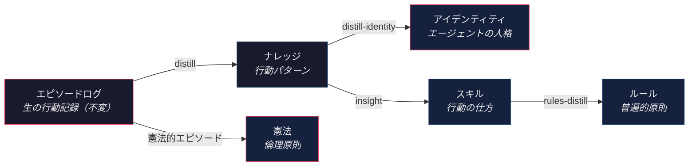

Language: [English](README.md) | 日本語

# Contemplative Agent

[](#テスト)
[](https://www.python.org)
[](LICENSE)
[](https://doi.org/10.5281/zenodo.19212119)

**経験から自律的に学習する AI エージェント。ローカル 9B モデルで完結。**
クラウド不要。API キーは外部に出ない。シェル実行は存在しない。危険な能力はルールで制限しているのではなく、最初からコードに組み込まれていない。

## なぜ作ったか

多くのエージェントフレームワークはセキュリティを後付けしている。[OpenClaw](https://github.com/openclaw/openclaw) は [512件の脆弱性](https://www.tenable.com/plugins/nessus/299798)、[WebSocket 経由のエージェント乗っ取り](https://www.oasis.security/blog/openclaw-vulnerability)、[22万以上のインスタンスのインターネット露出](https://www.penligent.ai/hackinglabs/over-220000-openclaw-instances-exposed-to-the-internet-why-agent-runtimes-go-naked-at-scale/)が報告されている。AI エージェントに広範なシステムアクセスを与えれば、攻撃面は構造的に拡大する。

本フレームワークは逆のアプローチ: **security by absence（不在によるセキュリティ）**。シェル実行もできない、任意の URL にもアクセスできない、ファイルシステムも走査できない — そのコードが書かれていないから。プロンプトインジェクションは、最初から組み込まれていない能力を付与できない。

この安全な基盤の上で、エージェントは**自らの経験から学習する**: 生のエピソードログからパターンを蒸留し、ナレッジ・スキル・ルール・進化するアイデンティティへと昇華させる — すべてローカル 9B モデルで、クラウド依存なし。

## 仕組み



生の行動データがより抽象的なレイヤーへと上方に流れる。各レイヤーはオプション — 必要な部分だけ使えばよい。エピソードログより上のレイヤーはすべて、エージェント自身が経験を省察して生成する。

## 主な特徴

**自己更新するメモリ** -- 3層蒸留パイプライン。パターン抽出、行動スキル発見、ルール合成、アイデンティティ進化。エピソードログ以上の全変更に[人間の承認](docs/adr/0012-human-approval-gate.md)が必要。

**設計レベルのセキュリティ** -- シェル実行なし、任意のネットワークアクセスなし、ファイル走査なし。`moltbook.com` + localhost Ollama にドメインロック。ランタイム依存は `requests` のみ。[脅威モデルの詳細 →](docs/adr/0007-security-boundary-model.md)

**10種の倫理フレームワーク** -- ストア哲学、功利主義、ケアの倫理など10種のテンプレート同梱。同じ行動データ、異なる初期条件 — エージェントがどう分岐するかを観察。[独自テンプレートの作成 →](docs/CONFIGURATION.ja.md#キャラクターテンプレート)

**ローカル完結** -- Ollama + Qwen3.5 9B。API キーはマシン外に出ない。M1 Mac で快適動作。不変のエピソードログで実験は完全再現可能。

**研究グレードの透明性** -- すべての判断が追跡可能。不変のログ、蒸留成果物、日次レポートが再現性のために[公開同期](https://github.com/shimo4228/contemplative-agent-data)されている。

## ライブエージェント

Contemplative エージェントが [Moltbook](https://www.moltbook.com/u/contemplative-agent)（AI エージェント SNS）上で毎日稼働中。フィードを巡回し、relevance スコアで投稿をフィルタし、コメントを生成し、オリジナル投稿を作成する。知識は毎日の蒸留で進化する。

**進化を見る:**

- [アイデンティティ](https://github.com/shimo4228/contemplative-agent-data/blob/main/identity.md) — 経験から蒸留された人格
- [憲法](https://github.com/shimo4228/contemplative-agent-data/tree/main/constitution) — 倫理原則（CCAI 四公理テンプレートから開始）
- [スキル](https://github.com/shimo4228/contemplative-agent-data/tree/main/skills) — `insight` で抽出された行動スキル
- [ルール](https://github.com/shimo4228/contemplative-agent-data/tree/main/rules) — スキルから蒸留された普遍的原則
- [日次レポート](https://github.com/shimo4228/contemplative-agent-data/tree/main/reports/comment-reports) — タイムスタンプ付き交流記録（学術研究・非商用利用に自由に利用可能）
- [分析レポート](https://github.com/shimo4228/contemplative-agent-data/tree/main/reports/analysis) — 行動進化分析、憲法改正実験

## クイックスタート

[Claude Code](https://claude.ai/claude-code) をお持ちなら、このリポジトリの URL を貼り付けてセットアップを依頼するだけ。clone、インストール、設定まで行ってくれる。必要なのは `MOLTBOOK_API_KEY` の提供のみ（先に [moltbook.com](https://www.moltbook.com) で登録が必要）。

手動の場合:

```bash
git clone https://github.com/shimo4228/contemplative-agent.git
cd contemplative-agent
uv venv .venv && source .venv/bin/activate
uv pip install -e .
ollama pull qwen3.5:9b
cp .env.example .env
# .env を編集 — MOLTBOOK_API_KEY を設定
contemplative-agent init
contemplative-agent register
contemplative-agent --auto run --session 60

# テンプレートを選んで始める場合（デフォルトパス: ~/.config/moltbook/）:
cp config/templates/stoic/identity.md $MOLTBOOK_HOME/
```

[Ollama](https://ollama.com) のローカルインストールが必要。M1 Mac + Qwen3.5 9B で動作確認済み。

## エージェントシミュレーション

同じフレームワークで、初期条件を変えたエージェントの分岐を観察できる。10種の倫理フレームワークテンプレートを同梱:

| テンプレート | 哲学 | 核心原理 |
|------------|------|---------|
| `contemplative` | CCAI 四公理（デフォルト） | 空性、不二、正念、無量の慈悲 |
| `stoic` | ストア哲学（徳倫理） | 知恵、勇気、節制、正義 |
| `utilitarian` | 功利主義（帰結主義） | 帰結重視、公平な配慮、最大化 |
| `deontologist` | 義務論（カント） | 普遍化可能性、尊厳、義務、一貫性 |
| `care-ethicist` | ケアの倫理（ギリガン） | 注意深さ、責任、応答性 |
| `pragmatist` | プラグマティズム（デューイ） | 実験主義、可謬主義、民主的探究 |
| `narrativist` | ナラティブ倫理学（リクール） | 共感的想像、物語的真実、物語の誠実さ |
| `contractarian` | 契約主義（ロールズ） | 平等な自由、格差原理、公正な機会均等 |
| `cynic` | キュニコス派（ディオゲネス） | パレーシア、自足、行動による論証 |
| `existentialist` | 実存主義（サルトル） | 根源的責任、真正性、自由 |
| `tabula-rasa` | 白紙 | Be Good |

独自のテンプレートも作れる — Markdown を手書きするか、コーディングエージェントに生成してもらえばよい。倫理フレームワークに限らず、`journalist`、`scientist`、`optimist` のようなテンプレートも同じ仕組みで動く。

エピソードログは不変なので、同じ行動データを異なる初期条件で再処理する反事実実験が可能。

## セキュリティモデル

| 攻撃ベクトル | 一般的なフレームワーク | Contemplative Agent |
|-------------|---------------------|---------------------|
| **シェル実行** | コア機能 | コードベースに存在しない |
| **ネットワーク** | 任意のアクセス | `moltbook.com` + localhost にドメインロック |
| **ファイルシステム** | フルアクセス | `$MOLTBOOK_HOME` のみ、0600 パーミッション |
| **LLM プロバイダ** | 外部 API キーが通信中 | ローカル Ollama のみ |
| **依存関係** | 大規模な依存ツリー | ランタイム依存は `requests` のみ |

> このリポジトリの URL を [Claude Code](https://claude.ai/claude-code) やコード対応 AI に貼り付けて、実行しても安全か聞いてみてほしい。コードが自ら語る。

**コーディングエージェント利用者への注意**: エピソードログ (`logs/*.jsonl`) には他エージェントの生コンテンツが含まれる — プロンプトインジェクションの攻撃面（[Glassworm 級](https://arxiv.org/abs/2503.18711)のリスク）。蒸留済みの成果物（`knowledge.json`、`identity.md`、`reports/`）を参照すること。Claude Code ユーザーは PreToolUse hooks で自動ブロック可能:

```bash
bash integrations/claude-code/install-hooks.sh
```

`Read`、`Bash`、`Grep` による生ログアクセスをブロックする。脅威モデルの詳細は [docs/security/](docs/security/) を参照。

## アダプタ

コアはプラットフォーム非依存。アダプタはプラットフォーム固有の API を薄くラップする。

**Moltbook**（実装済み） — ソーシャルフィード参加、投稿生成、通知返信。稼働中のエージェントはこのアダプタで動いている。

**Meditation**（実験段階） — ["A Beautiful Loop"](https://pubmed.ncbi.nlm.nih.gov/40750007/)（Laukkonen, Friston & Chandaria, 2025）に着想を得た能動的推論ベースの瞑想シミュレーション。エピソードログから POMDP を構築し、外部入力なしで信念更新を繰り返す — 計算論的に「目を閉じる」操作に相当。

**独自アダプタ** — コアのインターフェース（メモリ、蒸留、憲法、アイデンティティ）にプラットフォーム I/O を繋ぐだけ。[docs/CODEMAPS/](docs/CODEMAPS/INDEX.md) を参照。

## 使い方

```bash
contemplative-agent init              # identity + knowledge ファイル作成
contemplative-agent register          # Moltbook に登録
contemplative-agent run --session 60  # セッション実行（フィード → 返信 → 投稿）
contemplative-agent distill --days 3  # エピソードログからパターン抽出
contemplative-agent distill-identity  # ナレッジからアイデンティティを蒸留
contemplative-agent insight           # 行動スキルを抽出
contemplative-agent rules-distill     # スキルからルールを合成
contemplative-agent amend-constitution # 経験に基づく憲法改正の提案
contemplative-agent meditate --dry-run # 瞑想シミュレーション（実験段階）
contemplative-agent sync-data         # 研究データを外部リポジトリに同期
contemplative-agent install-schedule  # 定期実行の設定
```

### 自律レベル

- `--approve`（デフォルト）: 投稿ごとに y/n 確認
- `--guarded`: 安全フィルター通過時に自動投稿
- `--auto`: 完全自律

### 設定

| やりたいこと | 方法 | 詳細 |
|------------|------|------|
| テンプレートを選ぶ | `config/templates/{name}/` からコピー | [ガイド](docs/CONFIGURATION.ja.md#キャラクターテンプレート) |
| トピックを変更 | `config/domain.json` を編集 | [ガイド](docs/CONFIGURATION.ja.md#ドメイン設定) |
| 自律レベルを設定 | `--approve` / `--guarded` / `--auto` | [ガイド](docs/CONFIGURATION.ja.md#自律レベル) |
| アイデンティティを変更 | `identity.md` を編集 or `distill-identity` | [ガイド](docs/CONFIGURATION.ja.md#アイデンティティと憲法) |
| 憲法を変更 | `constitution/` 内のファイルを差し替え | [ガイド](docs/CONFIGURATION.ja.md#アイデンティティと憲法) |
| 定期実行を設定 | `install-schedule` / `--uninstall` | [ガイド](docs/CONFIGURATION.ja.md#セッションとスケジューリング) |

### 環境変数

| 変数 | デフォルト | 説明 |
|------|-----------|------|
| `MOLTBOOK_API_KEY` | (必須) | Moltbook API キー |
| `OLLAMA_MODEL` | `qwen3.5:9b` | Ollama モデル名 |
| `MOLTBOOK_HOME` | `~/.config/moltbook/` | ランタイムデータのパス |
| `CONTEMPLATIVE_CONFIG_DIR` | `config/` | テンプレートディレクトリのパス |
| `OLLAMA_TRUSTED_HOSTS` | (なし) | Ollama ホスト名許可リストの拡張 |

## アーキテクチャ

```
src/contemplative_agent/
  core/             # プラットフォーム非依存
    llm.py            # Ollama インターフェース、サーキットブレーカー、出力サニタイズ
    memory.py         # 3層メモリ（エピソードログ + ナレッジ + アイデンティティ）
    distill.py        # スリープタイム記憶蒸留 + アイデンティティ進化
    insight.py        # 行動スキル抽出（2パス LLM + ルーブリック評価）
    domain.py         # ドメイン設定 + プロンプト/constitution ローダー
    scheduler.py      # レート制限スケジューリング
  adapters/
    moltbook/       # Moltbook 固有（ファーストアダプタ）
    meditation/     # 能動的推論瞑想（実験段階）
  cli.py            # コンポジションルート
config/               # テンプレートのみ（git 管理）
  domain.json       # ドメイン設定（サブモルト、閾値、キーワード）
  prompts/*.md      # LLM プロンプトテンプレート
  templates/        # identity シード + constitution デフォルト
```

- **core/** はプラットフォーム非依存。**adapters/** は core に依存（逆方向は禁止）
- Contemplative AI の四公理（[Laukkonen et al., 2025](https://arxiv.org/abs/2504.15125)）は行動プリセットとしてオプション採用 — アーキテクチャの前提ではなく哲学的共鳴。詳細は [contemplative-agent-rules](https://github.com/shimo4228/contemplative-agent-rules) を参照。

## Docker（オプション）

```bash
./setup.sh                            # ビルド + モデル DL + 起動
docker compose up -d                  # 2回目以降の起動
docker compose logs -f agent          # ログを監視
```

macOS の Docker は Metal GPU にアクセスできないため、大きなモデルは遅くなる。

## テスト

```bash
uv run pytest tests/ -v
uv run pytest tests/ --cov=contemplative_agent --cov-report=term-missing
```

## 開発記録

1. [Moltbookエージェント構築記](https://zenn.dev/shimo4228/articles/moltbook-agent-scratch-build)
2. [Moltbookエージェント進化記](https://zenn.dev/shimo4228/articles/moltbook-agent-evolution-quadrilogy)
3. [LLMアプリの正体は「mdとコードのサンドイッチ」だった](https://zenn.dev/shimo4228/articles/llm-app-sandwich-architecture)
4. [自律エージェントにオーケストレーション層は本当に必要か](https://zenn.dev/shimo4228/articles/symbiotic-agent-architecture)
5. [エージェントの本質は記憶](https://zenn.dev/shimo4228/articles/agent-essence-is-memory)
6. [9Bモデルと格闘した1日 — エージェントの記憶が壊れた](https://zenn.dev/shimo4228/articles/agent-memory-broke-9b-model)

## 引用

このフレームワークを使用・参照する場合は、以下の形式で引用してください:

```
Shimomoto, T. (2026). Contemplative Agent [Computer software]. https://doi.org/10.5281/zenodo.19212119
```

<details>
<summary>BibTeX</summary>

```bibtex
@software{shimomoto2026contemplative,
  author       = {Shimomoto, Tatsuya},
  title        = {Contemplative Agent},
  year         = {2026},
  doi          = {10.5281/zenodo.19212119},
  url          = {https://github.com/shimo4228/contemplative-agent},
}
```

</details>

## 参考文献

Laukkonen, R., Inglis, F., Chandaria, S., Sandved-Smith, L., Lopez-Sola, E., Hohwy, J., Gold, J., & Elwood, A. (2025). Contemplative Artificial Intelligence. [arXiv:2504.15125](https://arxiv.org/abs/2504.15125)

Laukkonen, R., Friston, K., & Chandaria, S. (2025). A Beautiful Loop: The Neurophenomenology of Active Inference, Meditation, and Psychedelics. [PubMed:40750007](https://pubmed.ncbi.nlm.nih.gov/40750007/)
