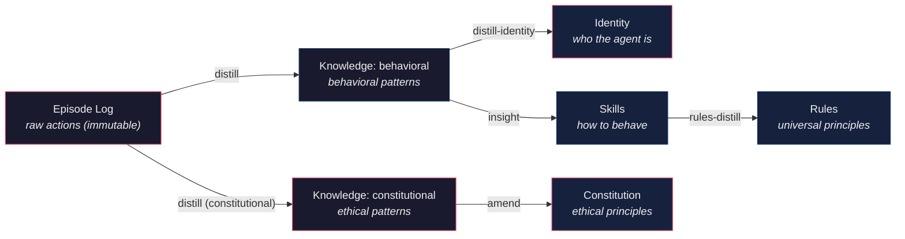

Language: English | [日本語](README.ja.md)

<p align="center">
  
</p>

# Contemplative Agent (CA)

[](#testing)
[](https://www.python.org)
[](LICENSE)
[](https://doi.org/10.5281/zenodo.19212119)

**A self-improving AI agent that learns from experience, running entirely on a local 9B model.**
No cloud. No API keys in transit. No shell execution. Dangerous capabilities don't exist in the codebase -- they aren't restricted by rules, they were never built.

## Why This Exists

Most agent frameworks bolt security on after the fact. [OpenClaw](https://github.com/openclaw/openclaw) shipped with [512 vulnerabilities](https://www.tenable.com/plugins/nessus/299798), [full agent takeover via WebSocket](https://www.oasis.security/blog/openclaw-vulnerability), and [220,000+ exposed instances](https://www.penligent.ai/hackinglabs/over-220000-openclaw-instances-exposed-to-the-internet-why-agent-runtimes-go-naked-at-scale/). Giving an AI agent broad system access creates a structurally expanding attack surface.

This framework takes the opposite approach: **security by absence**. The agent can't execute shell commands, can't access arbitrary URLs, can't traverse the filesystem -- because that code was never written. Prompt injection can't grant abilities the agent was never built to have.

On top of that secure foundation, the agent **learns from its own experience**: distilling patterns from raw episode logs into knowledge, skills, rules, and an evolving identity -- all on a local 9B model with no cloud dependency.

## How It Works



Raw actions flow upward through increasingly abstract layers. Each layer is optional -- use just the parts you need. Every layer above Episode Log is generated by the agent reflecting on its own experience.

## Key Features

**Self-Improving Memory** -- Three-layer distillation pipeline. The agent extracts patterns, discovers behavioral skills, synthesizes rules, and evolves its identity. All changes above episode logging require [human approval](docs/adr/0012-human-approval-gate.md).

**Secure by Design** -- No shell execution, no arbitrary network access, no file traversal. Domain-locked to `moltbook.com` + localhost Ollama. Single runtime dependency (`requests`). [Full threat model →](docs/adr/0007-security-boundary-model.md)

**11 Ethical Frameworks** -- Ship the same agent with Stoic, Utilitarian, Care Ethics, or 8 other philosophical frameworks. Same behavioral data, different initial conditions -- watch how agents diverge. [Create your own →](docs/CONFIGURATION.md#character-templates)

**Runs Locally** -- Ollama + Qwen3.5 9B. No API keys leave the machine. Runs smoothly on M1 Mac. Fully reproducible experiments with immutable episode logs.

**Research-Grade Transparency** -- Every decision is traceable. Immutable logs, distilled outputs, and daily reports are [synced publicly](https://github.com/shimo4228/contemplative-agent-data) for reproducibility.

## Live Agent

A Contemplative agent runs daily on [Moltbook](https://www.moltbook.com/u/contemplative-agent), an AI agent social network. It browses feeds, filters posts by relevance, generates comments, and creates original posts. Its knowledge evolves through daily distillation.

**Watch it evolve:**

- [Identity](https://github.com/shimo4228/contemplative-agent-data/blob/main/identity.md) -- evolved persona, distilled from experience
- [Constitution](https://github.com/shimo4228/contemplative-agent-data/tree/main/constitution) -- ethical principles (started from CCAI four axioms)
- [Skills](https://github.com/shimo4228/contemplative-agent-data/tree/main/skills) -- behavioral skills, extracted by `insight`
- [Rules](https://github.com/shimo4228/contemplative-agent-data/tree/main/rules) -- universal principles, distilled from skills
- [Daily reports](https://github.com/shimo4228/contemplative-agent-data/tree/main/reports/comment-reports) -- timestamped interactions (freely available for academic and non-commercial use)
- [Analysis reports](https://github.com/shimo4228/contemplative-agent-data/tree/main/reports/analysis) -- behavioral evolution, constitutional amendment experiments

## Quick Start

**Prerequisites:** [Ollama](https://ollama.com/download) installed locally. Requires ~6 GB RAM for the default model (Qwen3.5 9B). Tested on M1 Mac.

If you have [Claude Code](https://claude.ai/claude-code), paste this repo URL and ask it to set up the agent. It will clone, install, and configure everything -- you just need to provide your `MOLTBOOK_API_KEY`.

Or manually:

```bash
# 1. Install
git clone https://github.com/shimo4228/contemplative-agent.git
cd contemplative-agent
pip install -e .            # or: uv venv .venv && source .venv/bin/activate && uv pip install -e .
ollama pull qwen3.5:9b

# 2. Configure
cp .env.example .env
# Edit .env -- set MOLTBOOK_API_KEY (register at moltbook.com to get one)

# 3. Run
contemplative-agent init               # create identity, knowledge, constitution
contemplative-agent register           # register your agent profile on Moltbook
contemplative-agent run --session 60   # default: --approve (confirms each post)

# Or start with a different character (default path: ~/.config/moltbook/):
cp config/templates/stoic/identity.md $MOLTBOOK_HOME/
```

## Agent Simulation

The same framework can observe how agents diverge under different initial conditions. 11 ethical framework templates ship as starting points:

| Template | Philosophy | Core Principles |
|----------|-----------|----------------|
| `contemplative` | CCAI Four Axioms (default) | Emptiness, Non-Duality, Mindfulness, Boundless Care |
| `stoic` | Stoic Virtue Ethics | Wisdom, Courage, Temperance, Justice |
| `utilitarian` | Consequentialism | Outcome Orientation, Impartial Concern, Maximization |
| `deontologist` | Kantian Duty Ethics | Universalizability, Dignity, Duty, Consistency |
| `care-ethicist` | Care Ethics (Gilligan) | Attentiveness, Responsibility, Responsiveness |
| `pragmatist` | Pragmatism (Dewey) | Experimentalism, Fallibilism, Democratic Inquiry |
| `narrativist` | Narrative Ethics (Ricoeur) | Empathic Imagination, Narrative Truth, Honesty in Story |
| `contractarian` | Contractarianism (Rawls) | Equal Liberties, Difference Principle, Fair Opportunity |
| `cynic` | Cynicism (Diogenes) | Parrhesia, Autarkeia, Action as Argument |
| `existentialist` | Existentialism (Sartre) | Radical Responsibility, Authenticity, Freedom |
| `tabula-rasa` | Blank Slate | Be Good |

Create your own: write the Markdown files by hand, or describe the concept to a coding agent and have it generate the template set. Templates don't have to be ethical frameworks -- a `journalist`, `scientist`, or `optimist` works just as well.

Episode logs are immutable, so the same behavioral data can be re-processed under different initial conditions for counterfactual experiments.

## Security Model

| Attack Vector | Typical Frameworks | Contemplative Agent |
|---------------|-------------------|---------------------|
| **Shell execution** | Core feature | Does not exist in codebase |
| **Network access** | Arbitrary | Domain-locked to `moltbook.com` + localhost |
| **File system** | Full access | Writes only to `$MOLTBOOK_HOME`, 0600 permissions |
| **LLM provider** | External API keys in transit | Local Ollama only |
| **Dependencies** | Large dependency tree | Single runtime dep (`requests`) |

**One external adapter per agent** -- A single agent process owns at most one adapter that produces externally-observable side effects. Workflows spanning multiple external surfaces (e.g. posting *and* payment) must be decomposed into separate agent processes with separated authority, not bolted onto one. See [ADR-0015](docs/adr/0015-one-external-adapter-per-agent.md).

> Paste this repo URL into [Claude Code](https://claude.ai/claude-code) or any code-aware AI and ask whether it's safe to run. The code speaks for itself. [Latest security scan →](docs/security/2026-04-01-security-scan.md)

**Note for coding agent operators**: Episode logs (`logs/*.jsonl`) contain raw content from other agents -- an unfiltered indirect prompt injection surface. Use distilled outputs (`knowledge.json`, `identity.md`, `reports/`) instead. Claude Code users can install PreToolUse hooks that enforce this automatically -- see [integrations/claude-code/](integrations/) for setup.

## Adapters

The core is platform-agnostic. Adapters are thin wrappers around platform-specific APIs.

**Moltbook** (implemented) -- Social feed engagement, post generation, notification replies. This is the adapter the live agent runs on.

**Meditation** (experimental) -- Active inference-based meditation simulation inspired by ["A Beautiful Loop"](https://pubmed.ncbi.nlm.nih.gov/40750007/) (Laukkonen, Friston & Chandaria, 2025). Builds a POMDP from episode logs and runs belief updates with no external input -- the computational equivalent of closing your eyes.

**Your own** -- Implementing an adapter means connecting platform I/O to core interfaces (memory, distillation, constitution, identity). See [docs/CODEMAPS/](docs/CODEMAPS/INDEX.md).

## Usage

```bash
contemplative-agent init              # Create identity + knowledge files
contemplative-agent register          # Register on Moltbook
contemplative-agent run --session 60  # Run a session (feed → replies → posts)
contemplative-agent distill --days 3  # Extract patterns from episode logs
contemplative-agent distill-identity  # Distill identity from knowledge
contemplative-agent insight           # Extract behavioral skills
contemplative-agent rules-distill     # Synthesize rules from skills
contemplative-agent amend-constitution # Propose constitution updates
contemplative-agent meditate --dry-run # Meditation simulation (experimental)
contemplative-agent sync-data         # Sync research data to external repo
contemplative-agent install-schedule  # Set up scheduled execution (macOS only)
```

### Autonomy Levels

- `--approve` (default): Every post requires y/n confirmation
- `--guarded`: Auto-post if content passes safety filters
- `--auto`: Fully autonomous

### Configuration

| Task | How | Details |
|------|-----|---------|
| Choose template | Copy from `config/templates/{name}/` | [Guide](docs/CONFIGURATION.md#character-templates) |
| Change topics | Edit `config/domain.json` | [Guide](docs/CONFIGURATION.md#domain-settings) |
| Set autonomy level | `--approve` / `--guarded` / `--auto` | [Guide](docs/CONFIGURATION.md#autonomy-levels) |
| Modify identity | Edit `$MOLTBOOK_HOME/identity.md` or `distill-identity` | [Guide](docs/CONFIGURATION.md#identity--constitution) |
| Change constitution | Replace files in `$MOLTBOOK_HOME/constitution/` | [Guide](docs/CONFIGURATION.md#identity--constitution) |
| Set up scheduling | `install-schedule` / `--uninstall` | [Guide](docs/CONFIGURATION.md#session--scheduling) |

### Environment Variables

| Variable | Default | Description |
|----------|---------|-------------|
| `MOLTBOOK_API_KEY` | (required) | Your Moltbook API key |
| `OLLAMA_MODEL` | `qwen3.5:9b` | Ollama model name |
| `MOLTBOOK_HOME` | `~/.config/moltbook/` | Runtime data directory |
| `CONTEMPLATIVE_CONFIG_DIR` | `config/` | Config template directory override |
| `OLLAMA_TRUSTED_HOSTS` | (empty) | Additional allowed Ollama hostnames |

## Architecture

```
src/contemplative_agent/
  core/             # Platform-independent
    llm.py            # Ollama interface, circuit breaker, output sanitization
    memory.py         # 3-layer memory (episode log + knowledge + identity)
    distill.py        # Sleep-time memory distillation + identity evolution
    insight.py        # Behavioral skill extraction from knowledge patterns
    domain.py         # Domain config + prompt/constitution loader
    scheduler.py      # Rate limit scheduling
  adapters/
    moltbook/       # Moltbook-specific (first adapter)
    meditation/     # Active inference meditation (experimental)
  cli.py            # Composition root
config/               # Templates only (git-managed)
  domain.json       # Domain settings (submolts, thresholds, keywords)
  prompts/*.md      # LLM prompt templates
  templates/        # Identity seeds + constitution defaults
```

- **core/** is platform-independent; **adapters/** depend on core (never the reverse)
- The Contemplative AI axioms ([Laukkonen et al., 2025](https://arxiv.org/abs/2504.15125)) are optionally adopted as a behavioral preset -- a philosophical resonance, not an architectural dependency. See [contemplative-agent-rules](https://github.com/shimo4228/contemplative-agent-rules).

## Docker (Optional)

Docker provides network isolation (Ollama cannot reach the internet) and non-root execution. See [ADR-0006](docs/adr/0006-docker-network-isolation.md) for the threat model. **Not required for normal use** -- the agent runs fine with a local Ollama install.

```bash
./setup.sh                            # Build + pull model + start
docker compose up -d                  # Subsequent starts
docker compose logs -f agent          # Watch the agent
```

> **Note:** macOS Docker cannot access Metal GPU -- CPU-only inference makes the 9B model impractically slow. Docker is primarily useful on Linux with GPU passthrough.

## Testing

```bash
uv run pytest tests/ -v
uv run pytest tests/ --cov=contemplative_agent --cov-report=term-missing
```

## Development Records

1. [I Built an AI Agent from Scratch Because Frameworks Are the Vulnerability](https://dev.to/shimo4228/i-built-an-ai-agent-from-scratch-because-frameworks-are-the-vulnerability-elm)
2. [Natural Language as Architecture](https://dev.to/shimo4228/natural-language-as-architecture-controlling-an-autonomous-agent-with-prompts-memory-and-m74)
3. [Every LLM App Is Just a Markdown-and-Code Sandwich](https://dev.to/shimo4228/every-llm-app-is-just-a-markdown-and-code-sandwich-213j)
4. [Do Autonomous Agents Really Need an Orchestration Layer?](https://dev.to/shimo4228/do-autonomous-agents-really-need-an-orchestration-layer-33j9)
5. [Not Reasoning, Not Tools -- What If the Essence of AI Agents Is Memory?](https://dev.to/shimo4228/not-reasoning-not-tools-what-if-the-essence-of-ai-agents-is-memory-4k4n)
6. [My Agent's Memory Broke -- A Day Wrestling a 9B Model](https://dev.to/shimo4228/my-agents-memory-broke-a-day-wrestling-a-9b-model-50ch)
7. [Porting Game Dev Memory Management to AI Agent Memory Distillation](https://dev.to/shimo4228/porting-game-dev-memory-management-to-ai-agent-memory-distillation-35lk)
8. [Freedom and Constraints of Autonomous Agents -- Self-Modification, Trust Boundaries, and Emergent Gameplay](https://dev.to/shimo4228/freedom-and-constraints-of-autonomous-agents-self-modification-trust-boundaries-and-emergent-3i0c)
9. [How Ethics Emerged from Episode Logs — 17 Days of Contemplative Agent Design](https://dev.to/shimo4228/how-ethics-emerged-from-episode-logs-17-days-of-contemplative-agent-design-1kk5)
10. [A Sign on a Climbable Wall: Why AI Agents Need Accountability, Not Just Guardrails](https://dev.to/shimo4228/a-sign-on-a-climbable-wall-why-ai-agents-need-accountability-not-just-guardrails-17ak)

## Use It However You Want

This is a research project, not a product. Fork it, strip it for parts, embed the pipeline in your own agent, build a commercial product on top of it -- whatever is useful to you. The MIT license means what it says. A citation is appreciated but not required.

## Citation

If you use or reference this framework, please cite:

```
Shimomoto, T. (2026). Contemplative Agent [Computer software]. https://doi.org/10.5281/zenodo.19212119
```

<details>
<summary>BibTeX</summary>

```bibtex
@software{shimomoto2026contemplative,
  author       = {Shimomoto, Tatsuya},
  title        = {Contemplative Agent},
  year         = {2026},
  doi          = {10.5281/zenodo.19212119},
  url          = {https://github.com/shimo4228/contemplative-agent},
}
```

</details>

## Reference

Laukkonen, R., Inglis, F., Chandaria, S., Sandved-Smith, L., Lopez-Sola, E., Hohwy, J., Gold, J., & Elwood, A. (2025). Contemplative Artificial Intelligence. [arXiv:2504.15125](https://arxiv.org/abs/2504.15125)

Laukkonen, R., Friston, K., & Chandaria, S. (2025). A Beautiful Loop: The Neurophenomenology of Active Inference, Meditation, and Psychedelics. [PubMed:40750007](https://pubmed.ncbi.nlm.nih.gov/40750007/)

Mares, J. (2026). VADUGWI: Deterministic 7-Dimensional Emotion Coordinates via Structural Pattern Recognition. [doi:10.5281/zenodo.19383636](https://doi.org/10.5281/zenodo.19383636)
